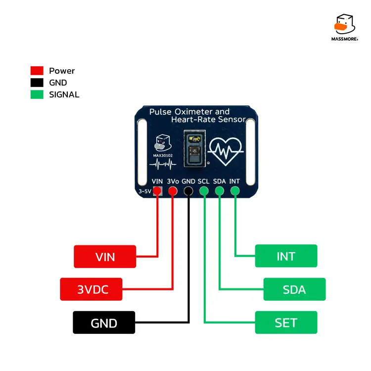

<div align="center">


# Massmore_MAX3010x

**Arduino / PlatformIO driver library for the Massmore MAX30102 Pulse Oximeter & Heart-Rate Sensor (SKU-0026)**


</div>

---

## 1. Product Overview

บอร์ดเซ็นเซอร์วัดอัตราการเต้นของหัวใจและออกซิเจนในเลือด (Pulse Oximeter / PPG) ใช้ชิป **MAX30102**
ของ Analog Devices ต่อผ่าน I2C Bus ตัวเดียว เหมาะกับ ESP32, ESP32-S3 และ Arduino Nano

*Designed and Manufactured by Massmore*

| Item | Spec |
|---|---|
| Sensor IC | MAX30102 (Red 660 nm + IR 880 nm, 18-bit ADC, 32-sample FIFO) |
| Interface | I2C (up to 400 kHz; examples use 100 kHz), address `0x57` (fixed) |
| Supply | 3.0 – 5.5 V (on-board 3.3 V LDO + 1.8 V LDO for the sensor core) |
| Logic level | I2C lines tolerate 3.3 V and 5 V (on-board level shifter) |
| Pull-ups | I2C pull-ups on board |
| Sample rate | 50 – 3200 Hz (configurable), on-chip averaging 1-32 |
| Die temperature | Built-in, 0.0625 °C resolution |
| INT pin | Open-drain, active-low (optional) |
| Connector | Qwiic-compatible 4-pin + 2.54 mm header |

> [!WARNING]
> **ไม่ใช่เครื่องมือแพทย์** — ค่าที่ได้ไม่ผ่านการสอบเทียบทางการแพทย์ ห้ามใช้วินิจฉัย ติดตามอาการ หรือรักษาโรค

### Supported chips

| Chip | PART_ID | LEDs | Status |
|---|---|---|---|
| **MAX30102** | 0x15 | Red + IR | **Full support** (chip on SKU-0026) |
| MAX30101 | 0x15 | Red + IR + 2×Green | Supported — เรียก `setVariant(Variant::MAX30101)` ก่อน `begin()` |
| MAX30105 | 0x15 | Red + IR + Green, proximity | Supported — เรียก `setVariant(Variant::MAX30105)` ก่อน `begin()` |
| MAX30100 | 0x11 | Red + IR | Not supported (different register map) — `begin()` returns `WRONG_ID` |

ทุกรุ่นคืน PART_ID 0x15 และจากการทดสอบบนชิปจริง register เฉพาะรุ่นก็เขียน-อ่านได้หมด จึงแยกรุ่นอัตโนมัติไม่ได้ ไลบรารีใช้ **MAX30102** เป็นค่าเริ่มต้น

---

## 2. Pinout Table

<div align="center">

</div>

| Pin | Function | Notes |
|---|---|---|
| **VIN** | Power input | 3.0 – 5.5 V |
| **3Vo** | 3.3 V output | จาก LDO บนบอร์ด จ่ายให้อุปกรณ์อื่นได้เล็กน้อย |
| **GND** | Ground | |
| **SCL** | I2C clock | Pull-up on board, 3.3 V / 5 V tolerant |
| **SDA** | I2C data | Pull-up on board, 3.3 V / 5 V tolerant |
| **INT** | Interrupt output | Open-drain, active-low — ต้องเปิด `INPUT_PULLUP` ฝั่ง MCU, ต่อหรือไม่ต่อก็ได้ |

---

## 3. MCU Compatibility & Limitation Matrix

| MCU Platform | Tested Core / Toolchain | Bus Remapping Support | Limitations / Notes |
|---|---|---|---|
| **ESP32-S3** | Arduino-ESP32 v3.x+ (pioarduino 55.03.311) — **hardware-tested on Massmore MOMO ESP32-S3** | Full GPIO Matrix (`Wire` / `Wire1`) | MOMO: SDA 14 / SCL 15, Serial ผ่าน USB-UART → ใช้ env `massmore-momo-esp32s3` (USB CDC On Boot = off). |
| **ESP32 (Classic)** | Arduino-ESP32 v3.x+ (pioarduino 55.03.311) — compile-tested | Full GPIO Matrix (`Wire` / `Wire1`) | None. Primary Factory Test target (SDA 21 / SCL 22). |
| **AVR — Arduino Nano (ATmega328P)** | Arduino AVR Core | Fixed Hardware Pins (I2C: A4/A5) | 2 KB SRAM / 32 KB Flash. Ring buffer ลดเป็น 8 samples อัตโนมัติ; ใช้ Simple API. 5 V logic — บอร์ดนี้มี level shifter จึงต่อตรงได้ |

RP2040 / STM32 ไม่ได้ทดสอบอย่างเป็นทางการ (ไลบรารีไม่มีโค้ดเฉพาะแพลตฟอร์ม จึงควร compile ผ่าน)

---

## 4. Installation

### Arduino IDE
1. ดาวน์โหลด [`ArduinoIDE/Massmore_MAX3010x.zip`](ArduinoIDE/Massmore_MAX3010x.zip)
2. **Sketch → Include Library → Add .ZIP Library…** เลือกไฟล์ที่ดาวน์โหลด
3. เปิดตัวอย่างจาก **File → Examples → Massmore_MAX3010x**
4. ESP32 ต้องติดตั้ง **esp32 by Espressif Systems v3.x** ใน Boards Manager
5. บอร์ด **Massmore MOMO ESP32-S3**: เลือก board **ESP32S3 Dev Module**, ตั้ง **USB CDC On Boot = Disabled** (Serial ออกทางชิป USB-UART) และ Flash Size = 16MB

### PlatformIO
เปิดโฟลเดอร์ [`PlatformIO/`](PlatformIO/) ด้วย VS Code แล้วกด **Build** ได้เลย
ไลบรารีอยู่ใน `lib/` แล้ว ไม่ต้องติดตั้งอะไรเพิ่ม (`platformio.ini` pin pioarduino 55.03.311 = Core 3.3.11)

```bash
cd PlatformIO
pio run -e esp32dev                          # หรือ esp32-s3-devkitc-1 / massmore-momo-esp32s3 / nano
pio run -e massmore-momo-esp32s3 -t upload -t monitor
```

`src/main.cpp` คือ `05_Factory_Test` — คัดลอก example อื่นมาทับได้ (เพิ่ม `#include <Arduino.h>` บรรทัดแรก)

---

## 5. Quick Start Code

```cpp
#include <Wire.h>
#include <Massmore_MAX3010x.h>

Massmore_MAX3010x sensor;

void setup() {
  Serial.begin(115200);
  Wire.begin(21, 22);          // ESP32 (MOMO S3: 14, 15) — sketch เป็นเจ้าของ I2C Bus (AVR: Wire.begin())
  Wire.setClock(100000);        // 100 kHz เสถียรที่สุด (ชิปรองรับถึง 400 kHz)

  if (!sensor.begin(Wire)) {   // ตรวจ PART_ID = 0x15 + soft-reset
    Serial.println(sensor.lastErrorString());
    while (1) delay(1000);
  }
  sensor.setupDefault();       // SpO2 mode, 50 samples/s, LED ~6 mA
}

void loop() {
  Massmore_MAX3010x::Readings r;
  if (sensor.readAll(r)) {     // Simple Blocking API
    Serial.print(r.red); Serial.print('\t'); Serial.println(r.ir);
  }
}
```

---

## 6. Pin Mapping Examples

**ESP32 (Classic) — Core 3.x custom GPIO**
```cpp
Wire.begin(21, 22);             // SDA, SCL (Qwiic default)
Wire1.begin(33, 32, 100000);    // I2C Bus ตัวที่สอง ย้ายขาได้อิสระ
sensor.begin(Wire1);
```

**ESP32-S3 (Massmore MOMO) — custom GPIO**
```cpp
Wire.begin(14, 15);             // SDA, SCL ของบอร์ด MOMO
Wire.setClock(100000);
sensor.begin(Wire);
```

**Arduino Nano — fixed hardware pins**
```cpp
Wire.begin();                   // SDA = A4, SCL = A5 (ย้ายไม่ได้)
Wire.setClock(100000);        // 100 kHz เสถียรที่สุด (ชิปรองรับถึง 400 kHz)
sensor.begin(Wire);
```

---

## 7. API Reference

| Function | Description (ไทย) | Return |
|---|---|---|
| `begin(TwoWire &wire = Wire, int8_t intPin = -1)` | เริ่มใช้งาน ตรวจ PART_ID และ soft-reset (ไม่เรียก `Wire.begin()`) | `bool` |
| `setupDefault(uint8_t ledPower = 0x1F)` | ตั้งค่าชุดมาตรฐาน SpO2 mode 50 samples/s | `bool` |
| `setup(ledPower, average, mode, rate, width, range)` | ตั้งค่าทั้งชุดในคำสั่งเดียว | `bool` |
| `readAll(Readings &out, uint32_t timeoutMs = 200)` | **Blocking** อ่าน sample เก่าสุด (Red / IR / Green) | `bool` |
| `readTemperature(uint32_t timeoutMs = 100)` | **Blocking** อ่าน die temperature | `float` / `NAN` |
| `requestConversion()` | **FSM** ล้าง FIFO เริ่มรอบเก็บข้อมูลใหม่ | `bool` |
| `update()` | **FSM** ดึงข้อมูลจาก FIFO ของชิปมาพัก (ไม่ block) | `bool` มีข้อมูลใหม่ |
| `isDataReady()` | **FSM** มี sample รออ่านหรือไม่ | `bool` |
| `getReadings(Readings &out)` | **FSM** ดึง sample เก่าสุดออกจาก buffer | `bool` |
| `startTemperatureConversion()` / `isTemperatureReady()` / `getTemperatureResult()` | อ่านอุณหภูมิแบบ non-blocking | `bool` / `bool` / `float` |
| `setMode()`, `setSampleRate()`, `setSampleAverage()`, `setPulseWidth()`, `setAdcRange()` | ตั้งค่ารายหัวข้อ (Read-Modify-Write) | `bool` |
| `setPulseAmplitudeRed/IR/Green/Proximity(uint8_t)` | กระแส LED 0-255 (~0.2 mA/LSB) | `bool` |
| `setFifoRollover()`, `setFifoAlmostFull()`, `clearFifo()`, `getSamplesInFifo()` | จัดการ FIFO | `bool` / `uint8_t` |
| `enableInterrupt(InterruptSource, bool)`, `getInterruptStatus1()` | Interrupt (อ่าน status = clear flag + ปล่อยขา INT) | `bool` / `uint8_t` |
| `verifyChipID()` | อ่าน PART_ID เทียบ 0x15 | `bool` |
| `getSerialNumber()` | MAX3010x ไม่มี serial register — คืน 0 | `uint32_t` |
| `isGenuine()` / `verifyChip()` | ตรวจของแท้ 11 ข้อ (reset ชิป ต้อง `setup()` ใหม่) | `bool` / `Genuine` |
| `getVariantName()`, `readRevisionID()` | ชื่อรุ่น (MAX30102/30101/30105), REV_ID | `const char*` / `uint8_t` |
| `getEffectiveSampleRate()` | อัตราข้อมูลจริง = rate ÷ average (Hz) | `float` |
| `setVariant(Variant)` | ระบุรุ่นชิป (ค่าเริ่มต้น MAX30102) — เรียกก่อน `begin()` | `void` |
| `lastError()` / `lastErrorString()` | `ErrorCode` ล่าสุด: `OK, NOT_FOUND, WRONG_ID, TIMEOUT, BUS_ERROR, NOT_READY, NOT_BEGUN, BAD_ARG, UNSUPPORTED` | `ErrorCode` / `const char*` |
| `readRegister8()`, `writeRegister8()`, `maskRegister8()`, `readRegisterBurst()` | เข้าถึง register ตรง | `bool` |

**Signal-processing helpers (optional)**

| Class | Description |
|---|---|
| `Massmore_MAX3010x::BeatDetector` | จับจังหวะชีพจรทีละ sample (`check(ir)` → `true` เมื่อเจอ beat, `getAverageBeatsPerMinute()`) |
| `Massmore_MAX3010x::Oximeter` | SpO2 ratio-of-ratios แบบ streaming ไม่ใช้ window buffer (`add(red, ir)` → `getResult()`), ปรับเส้นโค้งด้วย `setCalibration(a, b, c)` |

---

## 8. Examples

| # | Example | Description |
|---|---|---|
| 01 | `01_BasicRead` | Simple Blocking API, `Wire` default, พิมพ์ Red / IR (ดูรูปคลื่นใน Serial Plotter ได้) |
| 02 | `02_CustomPins_BusRemap` | ESP32 / S3 ใช้ `Wire1` บนขาที่กำหนดเอง, Nano ใช้ A4/A5 |
| 03 | `03_NonBlocking_Multitask` | FSM API + BeatDetector + blink LED + อุณหภูมิ non-blocking — loop ไม่ถูก block |
| 04 | `04_SpO2_HeartRate` | วัด SpO2 และ BPM ด้วย Oximeter พร้อม Perfusion Index |
| 05 | `05_Factory_Test` | **Outgoing QA** — `#RESULT` / `#VERDICT` สำหรับ Massmore Web Serial Monitor |

---

## 9. Factory Test & Web Serial Monitor

`05_Factory_Test` ทดสอบ BUS_SCAN → CHIP_ID / REV_ID → AUTHENTICITY (11 ข้อ) → RANGE_TEMP → LED_RESPONSE →
RANGE_RED / RANGE_IR → CONTINUOUS 20/20 → INT_PIN แล้วสรุปเป็น `#VERDICT PASS` / `[PASS] SENSOR QA PASSED - READY TO SHIP`

ไฟล์ `.bin` พร้อม flash, วิธี flash และ expected report อยู่ที่ [`firmware/README.md`](firmware/README.md)

---

## 10. Where to Buy

- massmore.shop: https://www.massmore.shop/products/71695ac8-75cb-43e1-b25e-e9de98029fc6
- Product docs (wiring): https://www.massmore.shop/docs/28
- Shopee: https://shopee.co.th/product/5641091/20081418990
- Lazada: https://www.lazada.co.th/products/pdp-i4821782571-s20039750050.html

---

## 11. License

MIT License · Copyright (c) 2026 Massmore Biz Co., Ltd.

<div align="center">

**Designed and Manufactured by Massmore** · [massmore.shop](https://www.massmore.shop)

</div>
