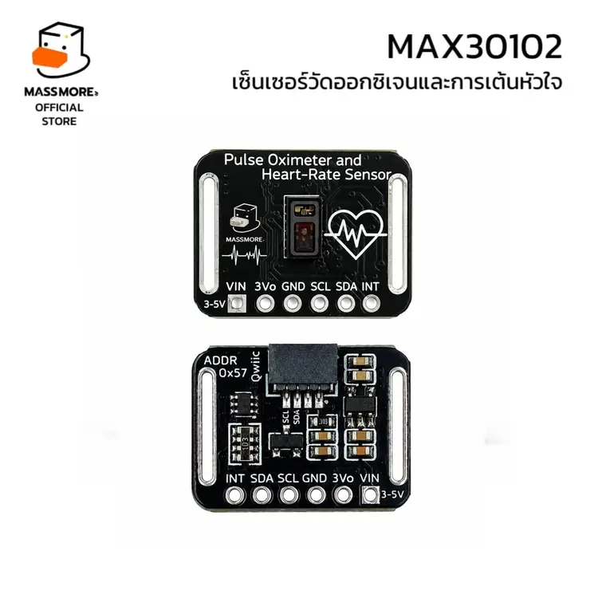
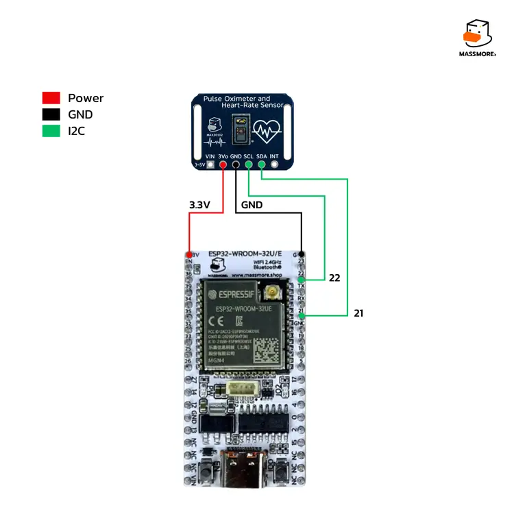

<div align="center">



# เฟิร์มแวร์ Factory Test

**Massmore MAX30102 · SKU-0026**

ไฟล์ `.bin` พร้อมอัปโหลด สำหรับตรวจสอบบอร์ดว่าใช้งานได้ครบทุกฟังก์ชันหรือไม่
ไม่ต้องติดตั้ง Arduino IDE ไม่ต้องคอมไพล์ ไม่ต้องเขียนโค้ดสักบรรทัด

</div>

---

## เฟิร์มแวร์ชุดนี้ทำอะไร

อัปโหลดลง ESP32 แล้วมันจะทดสอบบอร์ดเซ็นเซอร์ให้เองทันทีที่บูต ไม่ต้องพิมพ์อะไร
ผลออกทาง Serial ที่ **115200 bps** อ่านเป็นภาษาไทยได้เลย

การทดสอบแบ่งเป็นสามช่วง

| ช่วง | ทำอะไร | ถ้าไม่ผ่าน |
|---|---|---|
| **ด่านที่ 1** | สแกนบัส I2C ทั้งเส้นเพื่อหาชิปที่ address `0x57` | หยุดทันที พร้อมบอกว่าเจออุปกรณ์อะไรบ้างบนบัส |
| **ด่านที่ 2** | ตรวจตัวตนของชิป 11 ข้อ ว่าเป็น MAX3010x ของแท้จากโรงงาน | หยุดทันที พร้อมบอกว่าตกข้อไหน |
| **RUN TEST** | ทดสอบทุกความสามารถของชิปอีก 26 หัวข้อ | ทดสอบต่อจนจบ แล้วสรุปว่าตกข้อไหนบ้าง |

สองด่านแรกเป็นด่านคัดกรอง ถ้าไม่ผ่านจะไม่เข้า RUN TEST เลย เพราะทดสอบต่อไปก็ไม่มีความหมาย

---

## ไฟล์ในโฟลเดอร์นี้

```
firmware/esp32dev/
├── Massmore_MAX3010x_FactoryTest_v1.0.0_esp32dev_merged.bin   ← ไฟล์เดียวจบ เขียนที่ 0x0
├── Massmore_MAX3010x_FactoryTest_v1.0.0_esp32dev.bin          แอปพลิเคชันอย่างเดียว (0x10000)
├── bootloader.bin                                             (0x1000)
├── partitions.bin                                             (0x8000)
├── boot_app0.bin                                              (0xe000)
├── manifest.json          ข้อมูลการ build ตำแหน่ง offset และรูปแบบบรรทัดผลลัพธ์
├── SHA256SUMS.txt         ค่าแฮชไว้ตรวจว่าไฟล์ไม่เสียหายระหว่างดาวน์โหลด
├── flash_mac.command      สคริปต์อัปโหลดสำหรับ macOS (ดับเบิลคลิกได้เลย)
└── flash_linux.sh         สคริปต์อัปโหลดสำหรับ Linux
```

**ใช้ไฟล์ `_merged.bin` เป็นหลัก** ไฟล์เดียวครบทั้ง bootloader ตารางพาร์ทิชัน
และแอปพลิเคชัน เขียนที่ offset `0x0` ทีเดียวจบ

ไฟล์แยกทั้งสี่ไฟล์มีไว้เผื่อคนที่ต้องการเขียนทีละส่วน หรือทำ OTA เอง

---

## ข้อมูลการ build

| หัวข้อ | ค่า |
|---|---|
| บอร์ด | `esp32dev` (ESP32-WROOM-32 และตระกูลเดียวกัน) |
| Arduino ESP32 core | 3.3.11 |
| platform | pioarduino platform-espressif32 55.03.311 |
| flash mode / freq / size | dio / 40 MHz / 4 MB |
| ไลบรารี | Massmore_MAX3010x 1.0.0 |
| Serial monitor | 115200 bps |
| upload speed | 512000 |

> เฟิร์มแวร์นี้ build มาสำหรับ **ESP32 ตัวคลาสสิก** เท่านั้น
> ใช้กับ ESP32-S2 / S3 / C3 / C6 **ไม่ได้** เพราะเป็นสถาปัตยกรรมคนละตัว
> ถ้าใช้บอร์ดเหล่านั้น ให้เปิดโฟลเดอร์ `PlatformIO/` แล้ว build เองด้วย env ที่ตรงรุ่น

---

## การต่อสายก่อนอัปโหลด

<div align="center">

</div>

| MAX30102 | ESP32 | จำเป็นไหม |
|---|---|---|
| VIN | 3V3 | จำเป็น |
| GND | GND | จำเป็น |
| SDA | GPIO 21 | จำเป็น |
| SCL | GPIO 22 | จำเป็น |
| INT | GPIO 4 | ไม่จำเป็น ถ้าไม่ต่อ หัวข้อ `INT_PIN` จะขึ้น WARN เฉย ๆ ไม่ถือว่าบอร์ดเสีย |

ถ้าใช้สาย Qwiic ก็เสียบเส้นเดียวจบ ครบทั้งไฟเลี้ยงและสัญญาณ

---

## วิธีอัปโหลด

### macOS — ง่ายที่สุด

1. เสียบสาย USB ระหว่าง ESP32 กับเครื่อง (ต้องเป็นสายที่ส่งข้อมูลได้ ไม่ใช่สายชาร์จอย่างเดียว)
2. ติดตั้ง esptool ครั้งแรกครั้งเดียว

   ```bash
   pip3 install esptool
   ```

3. ดับเบิลคลิกไฟล์ `flash_mac.command`

สคริปต์จะหาพอร์ต USB ให้เอง แล้วเขียนไฟล์ `_merged.bin` ลงที่ offset `0x0`
ด้วยความเร็ว 512000

ครั้งแรกที่ดับเบิลคลิก macOS อาจไม่ยอมเปิดเพราะเป็นไฟล์จากอินเทอร์เน็ต
ให้คลิกขวาที่ไฟล์แล้วเลือก **Open** แทน หรือสั่งใน Terminal

```bash
chmod +x flash_mac.command
./flash_mac.command
```

### Linux

```bash
pip3 install esptool
chmod +x flash_linux.sh
./flash_linux.sh                 # หาพอร์ตให้เอง
./flash_linux.sh /dev/ttyUSB0    # หรือระบุพอร์ตเอง
```

ถ้าขึ้น `Permission denied` ให้เพิ่มตัวเองเข้ากลุ่ม `dialout` ก่อน แล้ว logout เข้าใหม่

```bash
sudo usermod -a -G dialout $USER
```

### Windows

เปิด Command Prompt หรือ PowerShell ในโฟลเดอร์นี้ แล้วสั่ง

```
pip install esptool
python -m esptool --chip esp32 --port COM3 --baud 512000 ^
  --before default_reset --after hard_reset ^
  write_flash -z --flash_mode dio --flash_freq 40m --flash_size detect ^
  0x0 Massmore_MAX3010x_FactoryTest_v1.0.0_esp32dev_merged.bin
```

เปลี่ยน `COM3` เป็นพอร์ตจริงของบอร์ด ดูได้จาก Device Manager

### ผ่านเว็บเบราว์เซอร์ (ไม่ต้องติดตั้งอะไรเลย)

ไฟล์ `_merged.bin` กับ `manifest.json` ใช้กับ **ESP Web Tools** ได้ทันที
เปิดด้วย Chrome หรือ Edge บนคอมพิวเตอร์ (มือถือไม่รองรับ Web Serial)

---

## อัปโหลดเสร็จแล้วจะเกิดอะไรขึ้น

ESP32 จะรีสตาร์ทเองแล้วเริ่มทดสอบทันที เปิด Serial Monitor ที่ **115200** จะเห็นแบบนี้

```
==================================================
 Massmore MAX30102 (SKU-0026) - ชุดทดสอบโรงงาน
 ไลบรารีเวอร์ชัน 1.0.0
==================================================

ด่านที่ 1  สแกนบัส I2C
  [PASS] I2C_SCAN          พบ MAX3010x ที่ 0x57  อุปกรณ์บนบัส 1 ตัว (0x57)

ด่านที่ 2  ตรวจตัวตนของชิป
      ผ่าน   1. ACK ที่ address 0x57
      ผ่าน   2. PART_ID = 0x15
      ผ่าน   3. REV_ID สมเหตุสมผล
      ...
  [PASS] CHIP_GENUINE      MAX30102 PART_ID 0x15 REV 0x15 ผ่าน 11/11 ข้อ

RUN TEST  ทดสอบความสามารถทั้งหมด

  [PASS] REG_RW            เขียนอ่าน LED2_PA ครบ 6 แพตเทิร์นตรงทุกค่า
  [PASS] REG_READONLY      PART_ID ยังเป็น 0x15 หลังพยายามเขียนทับ
  [PASS] RESERVED_BITS     บิตสงวน 5:3 ของ MODE_CONFIG เป็นศูนย์
  [PASS] FIFO_PTR          ตัวชี้ FIFO เป็นฟิลด์ 5 บิตและวนกลับถูกต้อง
  ...
      >>> วางนิ้วบนเซ็นเซอร์ภายใน 8 วินาที (ข้ามได้ถ้าทดสอบอัตโนมัติ)
  [PASS] PPG_FINGER        PI สูงสุด 1.42%  SpO2 97.30%  BPM 74.20

==================================================
 สรุปผลการทดสอบ
==================================================
  ชิปที่ตรวจพบ   MAX30102
  PART_ID        0x15
  REVISION_ID    0x15
  ตรวจของแท้     ผ่าน 11/11 ข้อ
--------------------------------------------------
  ผ่าน 28   ไม่ผ่าน 0   เตือน 0

  ผลรวม  >>> ผ่าน <<<
==================================================
```

ทั้งชุดใช้เวลาประมาณ **25 วินาที** โดยช่วงท้ายจะหยุดรอให้วางนิ้ว 8 วินาที
ถ้าไม่วางก็ข้ามไปเอง หัวข้อนั้นจะขึ้น WARN ไม่ถือว่าบอร์ดเสีย

พิมพ์ **`r`** แล้วกด Enter ใน Serial Monitor เพื่อทดสอบซ้ำ โดยไม่ต้องอัปโหลดใหม่

### ความหมายของสถานะแต่ละแบบ

| สถานะ | ความหมาย | ต้องทำอะไร |
|---|---|---|
| **PASS** | หัวข้อนั้นผ่าน | ไม่ต้องทำอะไร |
| **WARN** | ทดสอบไม่ได้เพราะขาดเงื่อนไขบางอย่าง เช่น ไม่ได้ต่อสาย INT หรือไม่มีคนวางนิ้ว | ตรวจดูว่าเป็นเพราะขั้นตอนการทดสอบหรือเป็นที่บอร์ด |
| **FAIL** | หัวข้อนั้นไม่ผ่านจริง | บอร์ดหรือการต่อสายมีปัญหา ดูหัวข้อแก้ปัญหาด้านล่าง |

**ผลรวมจะขึ้นว่าผ่าน ก็ต่อเมื่อไม่มีหัวข้อไหน FAIL เลย และผ่านด่านคัดกรองทั้งสองด่าน**

---

## รูปแบบบรรทัดสำหรับให้เครื่องอ่าน

บรรทัดที่ขึ้นต้นด้วย `#` มีไว้ให้โปรแกรมฝั่งเว็บหรือสคริปต์ในสายการผลิตอ่านอัตโนมัติ
ทุกฟิลด์คั่นด้วยจุลภาค

```
#RESULT,<ลำดับ>,<ชื่อหัวข้อ>,<PASS|FAIL|WARN>,<รายละเอียด>
#DEVICE,<addr>,<variant>,<part_id>,<rev_id>,<genuine>,<ผ่านกี่ข้อจาก11>
#VERDICT,<PASS|FAIL>,<ผ่าน>,<ไม่ผ่าน>,<เตือน>
```

ตัวอย่างจริง

```
#RESULT,4,FIFO_PTR,PASS,ตัวชี้ FIFO เป็นฟิลด์ 5 บิตและวนกลับถูกต้อง
#DEVICE,0x57,MAX30102,0x15,0x15,1,11
#VERDICT,PASS,28,0,0
```

ค่าในฟิลด์ `<genuine>` ของบรรทัด `#DEVICE`

| ค่า | ความหมาย |
|---|---|
| 0 | ยังไม่ได้ตรวจ |
| 1 | ชิปแท้ ผ่านครบ 11 ข้อ |
| 2 | น่าจะเป็นของแท้ ผ่าน 9 หรือ 10 ข้อ |
| 3 | น่าสงสัย ผ่านน้อยกว่า 9 ข้อ |
| 4 | ไม่ใช่ชิปตระกูล MAX3010x |

รายละเอียดของทุกฟิลด์อยู่ในไฟล์ `manifest.json` ส่วน `serial_markers`

---

## แก้ปัญหา

<details>
<summary><b>อัปโหลดไม่ผ่าน ขึ้น Timed out waiting for packet header</b></summary>

ความเร็ว 512000 สูงเกินไปสำหรับสายหรือชิป USB ที่ใช้อยู่
เปิดไฟล์ `flash_mac.command` หรือ `flash_linux.sh` แล้วแก้บรรทัด

```bash
BAUD=512000
```

เป็น `460800` ถ้ายังไม่ได้ให้ลด `115200` ซึ่งช้าลงแต่ทนที่สุด

</details>

<details>
<summary><b>อัปโหลดไม่ผ่าน ขึ้น Failed to connect to ESP32</b></summary>

1. สายที่ใช้ต้องส่งข้อมูลได้ สายชาร์จบางเส้นมีแต่ไฟเลี้ยง ลองเปลี่ยนสาย
2. บอร์ด ESP32 บางรุ่นไม่มีวงจร auto-reset ต้อง **กดปุ่ม BOOT ค้างไว้** ตอนที่ esptool
   ขึ้นข้อความ `Connecting...` แล้วปล่อยเมื่อเริ่มเขียน
3. ปิดโปรแกรมอื่นที่เปิดพอร์ตนั้นค้างไว้ (Arduino IDE Serial Monitor, screen, minicom)

</details>

<details>
<summary><b>หาพอร์ต USB ไม่เจอ</b></summary>

ต้องติดตั้งไดรเวอร์ USB-to-Serial ตามชิปที่บอร์ด ESP32 ใช้

| ชิปบนบอร์ด | ไดรเวอร์ |
|---|---|
| CP2102 / CP2104 | Silicon Labs CP210x VCP |
| CH340 / CH9102 | WCH CH34x |

macOS รุ่นใหม่มีไดรเวอร์ CH34x มาให้แล้ว แต่ CP210x ยังต้องติดตั้งเอง
ตรวจว่าเจอพอร์ตแล้วหรือยังด้วย

```bash
ls /dev/cu.*          # macOS
ls /dev/ttyUSB*       # Linux
```

</details>

<details>
<summary><b>Serial Monitor ขึ้นตัวอักษรมั่ว</b></summary>

ตั้งความเร็วผิด ต้องเป็น **115200** เท่านั้น
ถ้าตั้งถูกแล้วยังมั่ว แสดงว่าอัปโหลดไม่สมบูรณ์ ให้อัปโหลดใหม่ด้วยความเร็วที่ต่ำลง

</details>

<details>
<summary><b>ตัวอักษรไทยขึ้นเป็นสี่เหลี่ยมหรือเครื่องหมายคำถาม</b></summary>

Serial Monitor ที่ใช้อยู่ไม่รองรับ UTF-8

- **Arduino IDE 2.x** รองรับอยู่แล้ว
- **PlatformIO Serial Monitor** รองรับอยู่แล้ว
- **screen** บน macOS ให้สั่ง `LANG=en_US.UTF-8 screen /dev/cu.usbserial-XXXX 115200`
- **PuTTY** ให้ตั้ง Window → Translation → Remote character set เป็น UTF-8

</details>

<details>
<summary><b>ด่านที่ 1 ไม่ผ่าน ขึ้นว่าไม่พบ 0x57 บนบัส</b></summary>

เฟิร์มแวร์จะพิมพ์รายชื่อ address ทั้งหมดที่เจอบนบัสมาให้ดูด้วย

- **ไม่เจออุปกรณ์ใดเลย** แปลว่าสายสัญญาณหรือไฟเลี้ยงมีปัญหา
  ตรวจ VIN, GND, SDA (GPIO 21) และ SCL (GPIO 22) ทีละเส้น
- **เจออุปกรณ์อื่นแต่ไม่มี 0x57** แปลว่าบัสใช้งานได้ แต่ชิปเซ็นเซอร์ไม่ตอบ
  อาจเป็นเพราะไฟเลี้ยงไม่ถึงตัวชิป หรือชิปเสีย
- ถ้าใช้สายยาวเกิน 30 ซม. ลองเปลี่ยนสายให้สั้นลง

</details>

<details>
<summary><b>ด่านที่ 2 ไม่ผ่าน ขึ้นว่าชิปไม่ผ่านการตรวจตัวตน</b></summary>

ดูรายการ 11 ข้อที่พิมพ์ออกมาว่าตกข้อไหน

- **ตกข้อ 2 (PART_ID)** ถ้าได้ `0x11` คือชิป MAX30100 คนละรุ่นกัน
  ถ้าได้ `0x00` หรือ `0xFF` คือสายสัญญาณมีปัญหา
- **ตกข้อ 7, 8, 9 หรือ 11** เป็นสัญญาณของชิปเลียนแบบที่จำลองด้วยไมโครคอนโทรลเลอร์
  บอร์ดของ Massmore ทุกตัวผ่านครบทั้ง 11 ข้อ ถ้าตกข้อเหล่านี้กรุณาติดต่อร้าน
- **ตกหลายข้อพร้อมกันแบบสุ่ม** มักเป็นสัญญาณรบกวนบนบัส ลองใช้สายสั้นลง

</details>

<details>
<summary><b>หัวข้อ LED_OFF_DARK ขึ้น WARN</b></summary>

ตอนปิด LED ทุกดวงแล้วยังอ่านค่าได้สูงกว่า 5000 นับ แปลว่ามีแสงจากภายนอกเข้าถึง
โฟโตไดโอด ลองบังแสงหรือย้ายออกจากใต้หลอดไฟโดยตรงแล้วทดสอบใหม่ด้วยการพิมพ์ `r`

</details>

<details>
<summary><b>หัวข้อ INT_PIN ขึ้น WARN</b></summary>

ปกติ เพราะยังไม่ได้ต่อขา INT ของบอร์ดเข้ากับ GPIO 4
ไม่ใช่ข้อบังคับ บอร์ดยังใช้งานได้ครบทุกฟังก์ชันแม้ไม่ต่อขานี้
ถ้าอยากทดสอบให้ครบก็ต่อสายเพิ่มหนึ่งเส้นแล้วพิมพ์ `r` เพื่อทดสอบซ้ำ

</details>

<details>
<summary><b>หัวข้อ PPG_FINGER ขึ้น WARN</b></summary>

ไม่มีใครวางนิ้วในช่วง 8 วินาทีที่เฟิร์มแวร์เปิดรอ หรือวางไม่คลุมหน้าต่างเซ็นเซอร์
ถ้าอยากทดสอบภาคออปติกให้ครบ ให้พิมพ์ `r` แล้ววางปลายนิ้วให้คลุมมิด
กดแนบพอประมาณ อย่ากดแรงจนบีบหลอดเลือด

</details>

<details>
<summary><b>อยาก build เฟิร์มแวร์นี้เอง</b></summary>

```bash
cd PlatformIO
cp examples/12_FactoryTest/main.cpp src/main.cpp
pio run -e esp32dev
```

ไฟล์ที่ได้อยู่ที่ `.pio/build/esp32dev/`

| ไฟล์ที่ build ได้ | ตรงกับไฟล์ในโฟลเดอร์นี้ |
|---|---|
| `firmware.bin` | `Massmore_MAX3010x_FactoryTest_v1.0.0_esp32dev.bin` |
| `firmware.factory.bin` | `Massmore_MAX3010x_FactoryTest_v1.0.0_esp32dev_merged.bin` |
| `bootloader.bin` | `bootloader.bin` |
| `partitions.bin` | `partitions.bin` |

ถ้าอยากเปลี่ยนขา I2C หรือขา INT ให้แก้ค่า `PIN_SDA`, `PIN_SCL`, `PIN_INT`
ที่ส่วนบนของไฟล์ตัวอย่างก่อน build

</details>

---

## ตรวจว่าไฟล์ไม่เสียหาย

```bash
cd esp32dev
shasum -a 256 -c SHA256SUMS.txt      # macOS
sha256sum -c SHA256SUMS.txt          # Linux
```

ทุกบรรทัดต้องขึ้น `OK` ถ้ามีบรรทัดไหนขึ้น `FAILED` ให้ดาวน์โหลดไฟล์นั้นใหม่

---

<div align="center">

**by Massmore** · [massmore.shop](https://www.massmore.shop) · MIT License

</div>
